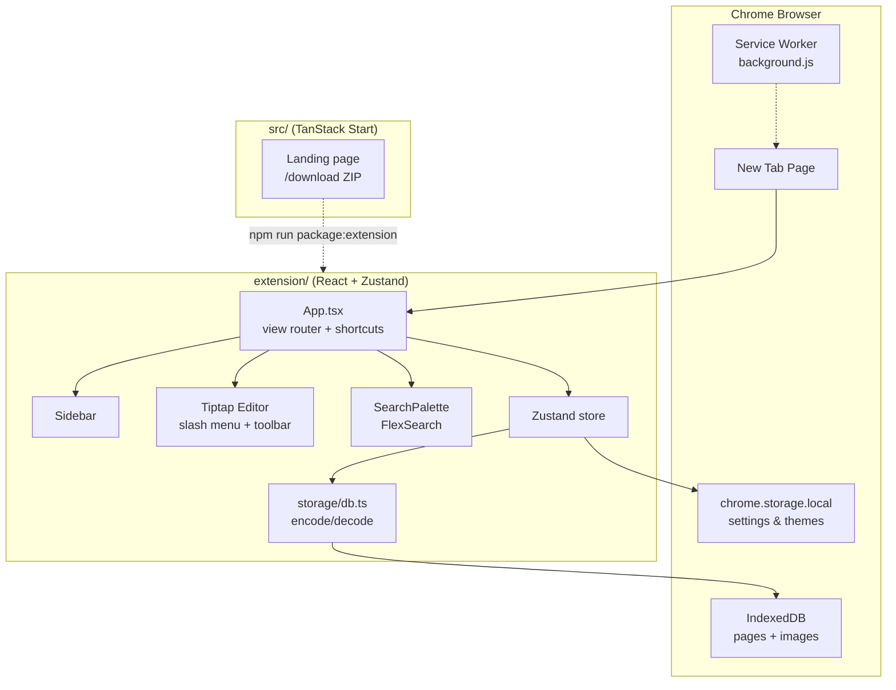

# KnowledgeOS

[](https://github.com/aryancodes-tech/knowledge-os/actions/workflows/ci.yml)
[](LICENSE)

**Personal knowledge management as a Chrome extension** - a Notion-inspired workspace and learning dashboard that replaces your New Tab page.

**Local-first · Offline-only · No backend · No account required**

Your notes and pages live entirely in the browser. Nothing is sent to a server.

---

## Table of contents

- [What is KnowledgeOS?](#what-is-knowledgeos)
- [Features](#features)
- [Architecture](#architecture)
- [Tech stack](#tech-stack)
- [Prerequisites](#prerequisites)
- [Local setup](#local-setup)
- [Development](#development)
- [Building & packaging](#building--packaging)
- [Project structure](#project-structure)
- [Data & privacy](#data--privacy)
- [Troubleshooting](#troubleshooting)
- [Contributing](#contributing)
- [License](#license)

---

## What is KnowledgeOS?

KnowledgeOS is a Chrome Manifest V3 extension that turns every new browser tab into a personal knowledge workspace. It is designed for developers, students, and lifelong learners who want a fast, keyboard-first place to capture notes, organize study material, and revisit recent work - without signing up for a cloud service.

The repository contains two apps:

| App                  | Path         | Purpose                                                  |
| -------------------- | ------------ | -------------------------------------------------------- |
| **Chrome extension** | `extension/` | Core product - editor, sidebar, search, themes, storage  |
| **Landing site**     | `src/`       | Marketing / download page with a one-click extension ZIP |

---

## Features

### Workspace & navigation

- **New Tab override** - KnowledgeOS loads automatically when you open a new tab
- **Dashboard** - greeting view with quick-create actions and recently edited pages
- **Sidebar** - favorites, recents, and a nested **Pages** workspace with folders and sub-pages
- **Global search** - `⌘K` / `Ctrl+K` palette powered by an in-memory FlexSearch index
- **Collapsible sidebar** - icon rail for a minimal layout

### Notion-style editor

Built on [Tiptap](https://tiptap.dev/) (ProseMirror) with auto-save and keyboard-first editing:

- **Slash commands** (`/`) - text, headings (H1–H4), bullet/numbered lists, to-do lists, quotes, code blocks, dividers
- **Formatting toolbar** - bold, italic, underline, strikethrough, links, text alignment
- **Rich text colors** - preset and custom text, highlight, and background colors
- **Code blocks** - syntax highlighting via lowlight
- **Debounced persistence** - changes save automatically (250 ms debounce)

### Themes & appearance

- **7 built-in themes** - Light, Dark, Midnight, Dracula, Solarized, Forest, Ocean
- **Custom themes** - create your own with background, text, and accent colors
- **CSS variable theming** - instant theme switches via `data-theme` on `<html>`

### Local-first storage

- **IndexedDB** - pages (compressed block JSON) and image blobs
- **chrome.storage.local** - lightweight settings (theme, last view, custom themes, collapsed folders)
- **No rendered HTML or markdown on disk** - only source block JSON is persisted; plain text is extracted on the fly for search
- **LZString compression** - documents are compacted before write
- **Versioned schema** - future features (AI, backlinks, sync, version history) can be added without data migrations

---

## Architecture



### Storage design principles

1. **Block JSON only** - every page is a Tiptap/ProseMirror `doc`; never store rendered HTML or duplicate markdown
2. **Images are separate** - binary blobs live in their own IndexedDB object store, referenced by id from blocks (no base64 in docs)
3. **Search index is ephemeral** - FlexSearch is rebuilt in memory on demand, never persisted
4. **Two-tier storage** - heavy data in IndexedDB, light settings in `chrome.storage.local`

For deeper extension internals, see [`extension/README.md`](extension/README.md).

---

## Tech stack

| Layer    | Extension (`extension/`)     | Landing site (`src/`)   |
| -------- | ---------------------------- | ----------------------- |
| UI       | React 18                     | React 19                |
| State    | Zustand                      | -                       |
| Editor   | Tiptap 2 + ProseMirror       | -                       |
| Styling  | Tailwind CSS 3               | Tailwind CSS 4          |
| Build    | Vite 5 + CRXJS               | Vite 7 + TanStack Start |
| Storage  | IndexedDB (`idb`) + LZString | -                       |
| Search   | FlexSearch                   | -                       |
| Language | TypeScript 5                 | TypeScript 5            |
| Tests    | Vitest (root)                | Vitest (root)           |

The two apps are intentionally separate today - no shared workspace packages yet. Toolchain versions differ by design until a monorepo workspace is introduced.

---

## Prerequisites

| Requirement       | Version / notes                                       |
| ----------------- | ----------------------------------------------------- |
| **Node.js**       | `>= 24.16.0` (see [`.nvmrc`](.nvmrc))                 |
| **npm**           | Canonical package manager for this repo               |
| **Google Chrome** | For loading the unpacked extension during development |

Recommended: use [nvm](https://github.com/nvm-sh/nvm) to match the pinned Node version.

```bash
nvm use
```

---

## Local setup

### 1. Clone and install dependencies

```bash
git clone https://github.com/aryancodes-tech/knowledge-os.git
cd knowledge-os

# Root workspace (landing site, lint, tests, CI scripts)
npm install

# Extension workspace (Chrome MV3 app)
npm install --prefix extension
```

### 2. Start the extension dev server

From the repo root:

```bash
npm run dev
```

This runs the Vite dev server inside `extension/` with hot module replacement (HMR). The dev server listens on **port 5173**.

Equivalent from inside `extension/`:

```bash
cd extension
npm run dev
```

### 3. Load the extension in Chrome

1. Open `chrome://extensions`
2. Enable **Developer mode** (top-right toggle)
3. Click **Load unpacked**
4. Select the `extension/dist/` folder
5. Confirm the extension name is **KnowledgeOS (Dev)** - not plain "KnowledgeOS"
6. Open a **new tab** - KnowledgeOS takes over

> **Keep `npm run dev` running** while you work. UI changes should hot-reload in open tabs. If they do not, open a fresh tab.

### 4. Verify your dev setup

```bash
npm run dev:check --prefix extension
```

This fails if `dist/manifest.json` reflects a production build instead of a dev build.

### 5. (Optional) Run the landing site locally

```bash
npm run dev:web
```

The landing site dev server runs on **port 8080** (`http://localhost:8080`). It provides a download button for the packaged extension ZIP.

To serve the download button locally, build the extension package first:

```bash
npm run package:extension
```

---

## Development

### Available scripts

Run these from the **repo root**:

| Command                     | Description                                                |
| --------------------------- | ---------------------------------------------------------- |
| `npm run dev`               | Extension dev server with HMR (alias for `dev:extension`)  |
| `npm run dev:extension`     | Extension dev server                                       |
| `npm run dev:web`           | Landing site dev server (port 8080)                        |
| `npm run build:extension`   | Production extension build                                 |
| `npm run build:web`         | Production landing site build                              |
| `npm run package:extension` | Build + zip extension → `public/knowledgeos-extension.zip` |
| `npm run lint`              | ESLint across web + extension                              |
| `npm run format`            | Prettier write                                             |
| `npm run format:check`      | Prettier check (CI)                                        |
| `npm run typecheck`         | TypeScript - web + extension                               |
| `npm run test`              | Vitest unit tests                                          |
| `npm run test:watch`        | Vitest in watch mode                                       |
| `npm run ci`                | Full CI pipeline locally                                   |
| `npm run preview`           | Preview production web build                               |

Extension-only scripts (run with `--prefix extension`):

| Command                                | Description                                       |
| -------------------------------------- | ------------------------------------------------- |
| `npm run dev:reset --prefix extension` | Clean `dist/` + `.vite/`, then restart dev server |
| `npm run dev:check --prefix extension` | Verify dev manifest is loaded                     |
| `npm run dev:watch --prefix extension` | Rebuild `dist/` on every save (no HMR)            |

### Dev vs production builds

| Command                   | Output in `extension/dist/`                   | Chrome extension name |
| ------------------------- | --------------------------------------------- | --------------------- |
| `npm run dev`             | Dev bundle (loads from `localhost:5173`, HMR) | **KnowledgeOS (Dev)** |
| `npm run build:extension` | Static production bundle (no HMR)             | **KnowledgeOS**       |

**Do not run `npm run build:extension` during active development.** It replaces the dev `dist/` output. After a production build, extension reload only shows old bundled code until you rebuild again.

`npm run dev` runs `predev`, which clears `dist/` and `.vite/` first so CRXJS always generates a fresh dev build.

### Run the full CI suite locally

Before opening a pull request:

```bash
npm run ci
```

This runs lint, format check, typecheck, tests, and production builds for both the extension and landing site.

### Code conventions

- **Constants** - put magic values in `extension/src/lib/constants.ts`
- **Empty strings** - use `len(value) > 0` from `extension/src/lib/text.ts`
- **Storage** - persist block JSON only; never store rendered HTML or markdown
- **Types** - keep domain models in `extension/src/storage/types.ts`
- **Tests** - live next to the code they cover (`*.test.ts`)

See [CONTRIBUTING.md](CONTRIBUTING.md) for the full contributor guide and PR checklist.

---

## Building & packaging

### Production extension build

```bash
npm run build:extension
```

Stop the dev server first. Reload the unpacked extension in `chrome://extensions` after the build completes.

### Package for distribution

```bash
npm run package:extension
```

This:

1. Builds the production extension
2. Creates `extension/knowledgeos-extension.zip`
3. Copies the ZIP to `public/knowledgeos-extension.zip` for the landing page download button

> Do not commit `public/knowledgeos-extension.zip` - CI and release workflows build it on demand.

### Install from ZIP (end users)

1. Download and unzip `knowledgeos-extension.zip`
2. Open `chrome://extensions`
3. Enable **Developer mode**
4. Click **Load unpacked** and select the unzipped folder
5. Open a new tab

---

## Project structure

```
knowledge-os/
├── extension/                  # Chrome MV3 extension (core product)
│   ├── public/
│   │   ├── background.js       # Service worker
│   │   └── icons/              # 16 / 48 / 128 px PNGs
│   ├── manifest.config.ts      # MV3 manifest (CRXJS source of truth)
│   ├── newtab.html             # Vite entry - becomes the new-tab page
│   ├── src/
│   │   ├── App.tsx             # Root, keyboard shortcuts, view router
│   │   ├── components/         # Sidebar, SearchPalette, dialogs, theme UI
│   │   ├── editor/             # Tiptap editor, slash menu, toolbar
│   │   ├── views/              # Dashboard, PageView
│   │   ├── store/              # Zustand store
│   │   ├── storage/            # IndexedDB + LZString codec + types
│   │   └── lib/                # Constants, themes, text helpers
│   └── README.md               # Extension architecture deep-dive
├── src/                        # Landing site (TanStack Start)
│   ├── routes/                 # File-based routes (`/` landing page)
│   ├── components/ui/          # shadcn-style UI primitives
│   └── server.ts               # SSR entry with error wrapper
├── public/                     # Static assets for landing site
├── .github/workflows/ci.yml    # CI pipeline
├── CONTRIBUTING.md
├── CHANGELOG.md
└── package.json                # Root scripts orchestrating both apps
```

---

## Data & privacy

- **All data stays on your machine** - pages, images, and settings are stored in Chrome's local storage APIs
- **No network calls** - the extension works fully offline after install (dev mode connects to `localhost:5173` for HMR only)
- **No analytics or telemetry** - nothing is phoned home
- **Uninstalling removes extension storage** - export important notes before removing the extension if you need a backup (import/export is on the roadmap)

---

## Troubleshooting

### Changes don't appear after editing

```bash
# Stop the dev server (Ctrl+C), then:
npm run dev:reset --prefix extension
```

In Chrome:

1. Go to `chrome://extensions`
2. Click **Reload** on **KnowledgeOS (Dev)** - or remove and **Load unpacked** again on `extension/dist/`
3. Open a **new tab** (existing tabs may keep old code)

### Extension shows "KnowledgeOS" instead of "KnowledgeOS (Dev)"

You loaded a production build. Restart the dev server:

```bash
npm run dev
```

Then reload the extension in Chrome.

### `dev:check` fails

`dist/manifest.json` is a production manifest. Run `npm run dev:reset --prefix extension` and reload the extension.

### HMR not working

Use the watch fallback - rebuilds on every save:

```bash
npm run dev:watch --prefix extension
```

Click **Reload** on the extension card in `chrome://extensions` after each change.

### Landing page download fails

Build the ZIP first:

```bash
npm run package:extension
```

Then refresh the landing page and try again.

---

## Contributing

We welcome contributions. See [CONTRIBUTING.md](CONTRIBUTING.md) for setup, conventions, and the PR checklist.

- [Code of Conduct](CODE_OF_CONDUCT.md)
- [Security policy](SECURITY.md)
- [Changelog](CHANGELOG.md)

### Roadmap-ready architecture

The storage schema and module boundaries are designed so these can be added without data migrations:

- AI search, summaries, and flashcards (reads the same block JSON)
- Backlinks and page mentions (graph built dynamically from blocks)
- Cloud sync (Google Drive, GitHub, or custom) - same block JSON on the wire
- Version history (append-only snapshots in a sibling object store)

---

## License

[MIT](LICENSE) - Copyright (c) 2026 KnowledgeOS Contributors
