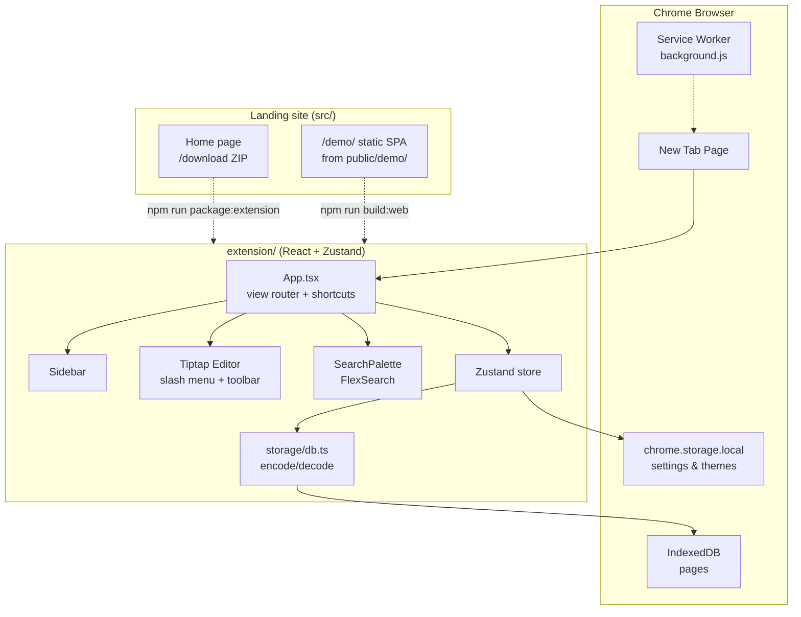

# MyMemos - Extension & shared app

The core product lives here: React UI, editor, storage, and Chrome MV3 packaging. The same `src/` code also builds the **live demo** at `/demo/` on the landing site.

For repo-wide setup, commands, and hosting deploy → [root README](../README.md).

---

## Architecture

### Two delivery modes

| Mode | Entry | Build | Storage |
| ---- | ----- | ----- | ------- |
| **Chrome extension** | `newtab.html` + `manifest.config.ts` | `vite.config.ts` (CRXJS) → `dist/` | IndexedDB + `chrome.storage.local` |
| **Web demo** | `index.html` | `vite.web.config.ts` → `public/demo/` | IndexedDB + `localStorage` |

Data does not sync between modes (different browser origins).

### System diagram



### Storage design principles

1. **Block JSON only** - every page is a Tiptap/ProseMirror `doc`. Never persist rendered HTML or duplicate markdown.
2. **Search index is ephemeral** - FlexSearch is rebuilt in memory on demand, never written to disk.
3. **Two-tier storage** - heavy page data in IndexedDB; light settings (theme, last view, custom themes, collapsed folders) in `chrome.storage.local` or `localStorage` on web.
4. **Attachments in OPFS** - images and voice notes store binary files in the browser's Origin Private File System (hidden, per-origin). Block JSON holds only relative paths and metadata (`attachmentPath`, `duration`, `size`, `title`). In-progress voice recordings are **never** persisted.

### Attachments & voice notes

```
IndexedDB (pages)          OPFS (mymemos-attachments/)
├── doc_c (BlockDoc)       ├── images/img_*.png
│   └── voiceNote attrs    └── audio/voice_*.webm
│       attachmentPath ────────────────┘
```

| Feature | Entry points | Key modules |
| ------- | ------------ | ----------- |
| Inline voice recording | Toolbar mic, `/` → Voice note | `insertVoiceRecording.ts`, `VoiceNoteNodeView.tsx`, `voiceRecorder.ts` |
| Attach audio file | Toolbar paperclip, `/` → Audio file | `insertAudioFromFile.ts` |
| Images | Toolbar image, paste | `insertImage.ts`, `AttachmentImageNodeView.tsx` |
| Delete attachment | Trash on voice note block | `AttachmentDeleteDialog`, `attachmentManager.ts` |

**Permissions:** Microphone is requested only when recording starts. OPFS needs no folder picker.

**Persistence rules:**

- `sanitizeBlockDocForPersistence()` strips `status: "recording"` blocks before save (`Editor.tsx`).
- Page delete removes orphaned OPFS files when no other page references the path (`sanitizeBlockDoc.ts` + `useStore.deletePage`).
- Copy/paste duplicate blocks share the same path — deleting one block removes the file for all copies (known limitation).

**Verify:**

```bash
npm run test -- extension/src/lib/attachments/
npm run dev   # record, play, rename label, delete, reload page
```

---

- **Manifest V3** - service worker (`background.js`), `chrome_url_overrides.newtab` → `newtab.html`.
- **LZString compression** - documents are compacted before IndexedDB write; schema versioned via `DB_VERSION` for non-destructive upgrades.
- **Themes** - 7 built-in + custom; switched via `data-theme` on `<html>` and CSS variables.

### Tech stack (this package)

| Layer | Choice |
| ----- | ------ |
| UI | React 18 |
| State | Zustand |
| Editor | Tiptap 2 + ProseMirror |
| Styling | Tailwind CSS 3 |
| Build | Vite 5 + CRXJS (extension), Vite 5 (web demo) |
| Storage | IndexedDB (`idb`) + LZString |
| Search | FlexSearch (in-memory) |
| Language | TypeScript 5 |

The landing site (`../src/`) is a separate TanStack Start app - React 19, Tailwind 4, Vite 7.

---

## Project layout

```
extension/
├── public/
│   ├── background.js     ← service worker
│   └── icons/            ← 16 / 48 / 128 px PNGs
├── manifest.config.ts    ← MV3 manifest (CRXJS source of truth)
├── newtab.html           ← Chrome extension entry
├── index.html            ← Web demo entry
├── src/
│   ├── App.tsx           ← root, shortcuts, view router
│   ├── components/       ← Sidebar, SearchPalette, dialogs
│   ├── editor/           ← Tiptap, slash menu, toolbar
│   ├── views/            ← Dashboard, PageView
│   ├── store/            ← Zustand
│   ├── storage/          ← IndexedDB, codec, types
│   └── lib/
│       ├── constants.ts
│       └── attachments/  ← OPFS manager, voice recorder, sanitize
├── vite.config.ts        ← Chrome extension build
├── vite.web.config.ts    ← Web demo → ../public/demo/
└── package.json
```

---

## Develop (Chrome, hot reload)

```bash
cd extension
npm install
npm run dev          # :5173, HMR
```

Chrome setup (one-time):

1. `chrome://extensions` → **Developer mode**
2. **Load unpacked** → `extension/dist/`
3. Name must be **MyMemos (Dev)** - open a **new tab**

| Command | `dist/` output | Extension name |
| ------- | -------------- | -------------- |
| `npm run dev` | Dev bundle (HMR via `localhost:5173`) | **MyMemos (Dev)** |
| `npm run build` | Static production bundle | **MyMemos** |

Do not run `npm run build` during active dev - it replaces the dev bundle. `predev` clears `dist/` and `.vite/` before each dev start.

**Stuck?** `npm run dev:reset` → reload extension in Chrome → new tab. Verify with `npm run dev:check`. Fallback: `npm run dev:watch` + manual reload in `chrome://extensions`.

---

## Web demo (browser, no install)

```bash
npm run dev:web      # from extension/, or npm run dev:app from repo root
```

- With landing: `http://localhost:8080/demo/` (`npm run dev:web` from root)
- Standalone: `http://localhost:5174/demo/` (from `extension/` only)

Production: `npm run build:web` → `../public/demo/` (served by the landing deploy).

---

## Production & packaging

```bash
npm run build        # production extension → dist/
npm run package      # zip → mymemos-extension.zip
```

From repo root: `npm run build:extension`, `npm run package:extension` (also copies ZIP to `public/` for the download button).

Stop `npm run dev` before a production build. Reload the unpacked extension after `build`.

---

## Roadmap-ready

Storage schema and module boundaries support adding these without data migrations:

- AI search, summaries, flashcards (same block JSON)
- Backlinks and page mentions (graph from blocks)
- Cloud sync (block JSON on the wire)
- Version history (append-only snapshots in a sibling object store)

---

## Contributing

See [CONTRIBUTING.md](../CONTRIBUTING.md). Run `npm run ci` from the repo root before opening a PR.
