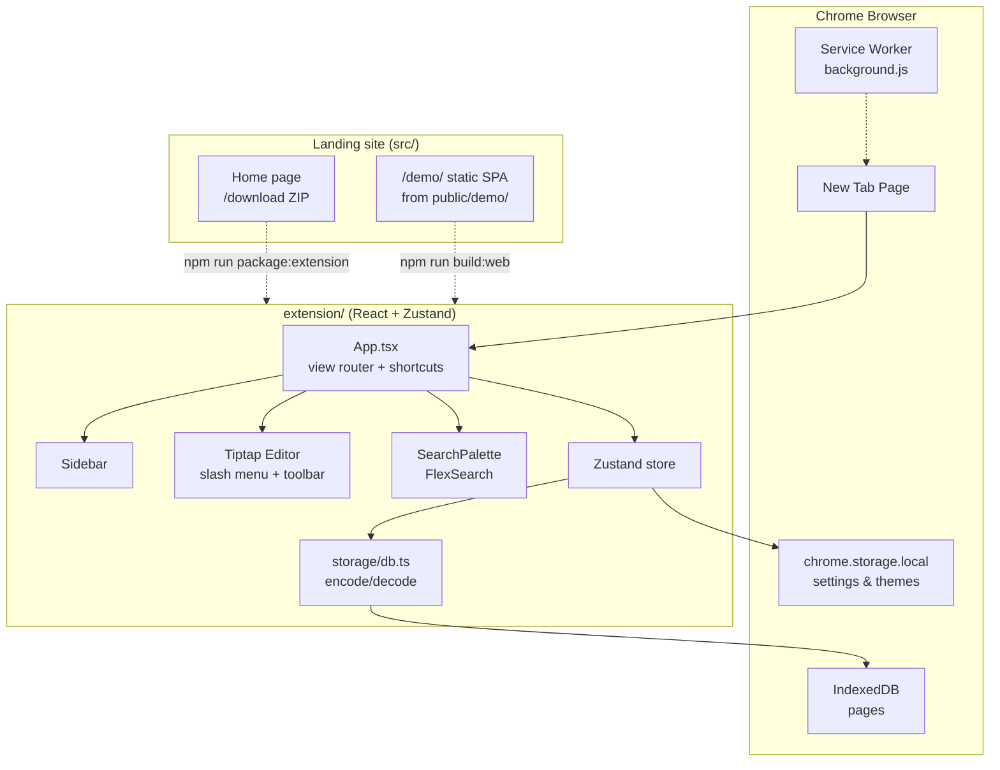

# MyMemos - Extension & shared app

The core product lives in this package: React UI, editor, storage, and Chrome MV3 packaging. The same `src/` tree also builds the **live demo** served at `/demo/` on the landing site.

Repo-wide setup, commands, and hosting deploy are documented in the [root README](../README.md).

Agent-facing capability inventory (shipped vs schema-only): [`AGENTS.md`](../AGENTS.md) §2.5.

---

## Current capabilities

| Area               | Behavior                                                                                              |
| ------------------ | ----------------------------------------------------------------------------------------------------- |
| Workspace          | Nested pages/folders, DnD move/reorder, rename, delete (with descendant warning), collapsible sidebar |
| Favorites / Recent | Starred pages; Favorites and Recent sidebar views (not separate storage sections)                     |
| Dashboard          | Recent pages and quick create                                                                         |
| Editor             | Headings, lists/tasks, tables, code blocks, colors, links, slash menu, toolbar, markdown paste        |
| Images             | Insert via toolbar/slash/drop/paste → OPFS; align, caption, lightbox, replace, alt text, delete       |
| Voice / audio      | Inline mic recording, attach audio file, waveform playback and speed, rename, download, delete        |
| Search             | ⌘K over title and body text (FlexSearch, ephemeral)                                                   |
| Themes             | 7 built-in plus custom themes                                                                         |
| Platforms          | Chrome New Tab extension **or** `/demo/` web SPA (separate origins; data does not sync)               |

**Not exposed in UI:** tag editing, archive, workspace export/import (`storage/db.ts` retains helpers only).

---

## Architecture

### Two delivery modes

| Mode                 | Entry                                | Build                                 | Storage                            |
| -------------------- | ------------------------------------ | ------------------------------------- | ---------------------------------- |
| **Chrome extension** | `newtab.html` + `manifest.config.ts` | `vite.config.ts` (CRXJS) → `dist/`    | IndexedDB + `chrome.storage.local` |
| **Web demo**         | `index.html`                         | `vite.web.config.ts` → `public/demo/` | IndexedDB + `localStorage`         |

The two modes use different browser origins; data does not sync between them.

### System diagram



### Storage design principles

1. **Block JSON only** — each page is a Tiptap/ProseMirror `doc`. Rendered HTML and parallel markdown copies are not persisted.
2. **Search index is ephemeral** — FlexSearch is rebuilt in memory on demand and is never written to disk.
3. **Two-tier storage** — page documents live in IndexedDB; light settings (theme, last view, custom themes, collapsed folders) live in `chrome.storage.local` or `localStorage` on web.
4. **Attachments in OPFS** — image and voice binaries live in the Origin Private File System (hidden, per-origin). Block JSON stores relative paths and metadata only (`attachmentPath`, `duration`, `size`, `title`). In-progress voice recordings are never persisted.

### Attachments & voice notes

```
IndexedDB (pages)          OPFS (mymemos-attachments/)
├── doc_c (BlockDoc)       ├── images/img_*.png
│   └── voiceNote attrs    └── audio/voice_*.webm
│       attachmentPath ────────────────┘
```

| Feature                | Entry points                                                                   | Key modules                                                                                                   |
| ---------------------- | ------------------------------------------------------------------------------ | ------------------------------------------------------------------------------------------------------------- |
| Inline voice recording | Toolbar mic, `/` → Voice note                                                  | `editor/commands/insertVoiceRecording.ts`, `VoiceNoteNodeView` + hooks, `voiceRecorder.ts`                    |
| Attach audio file      | Toolbar paperclip, `/` → Audio file                                            | `editor/commands/insertAudioFromFile.ts`                                                                      |
| Images                 | Toolbar image, `/` → Image, drag-drop, paste (file/screenshot/webpage ``) | `editor/commands/insertImage.ts`, `imageClipboard.ts`, `imagePasteDrop.ts`, `AttachmentImageNodeView` + hooks |
| Delete attachment      | Trash on voice note / image block                                              | `AttachmentDeleteDialog`, store `pendingAttachmentDelete`, `attachmentManager.ts`                             |

**Layering:** TipTap insert helpers live under `editor/commands/`; OPFS I/O stays in `lib/attachments/` (no TipTap types there).

**Image insert sources (all save to OPFS):**

- Toolbar / slash file picker (multi-select)
- Drag-drop onto the editor (including Mac screenshot thumbnails)
- Paste of image files or screenshots (`Cmd/Ctrl+V`)
- Paste of webpage HTML — remote/data `` sources are fetched into OPFS when possible

**Image UI:** Hover or selection shows a top-right toolbar (align left/center/right, download, delete, more). Opening the image expands a lightbox. A caption field sits under the image. The more menu includes Replace, Copy image, Alt text, and Expand. Backspace removes the block without a confirm dialog; the Delete control confirms and removes the OPFS file.

**Permissions:** The microphone is requested only when recording starts. OPFS does not require a folder picker.

**Persistence rules:**

- `sanitizeBlockDocForPersistence()` strips `status: "recording"` blocks before save (`Editor.tsx`).
- Page delete removes orphaned OPFS files when no other page references the path (`sanitizeBlockDoc.ts` + `useStore.deletePage`).
- Copied blocks that share a path share one file — deleting one block removes the file for all copies (known limitation).

**Verification:**

```bash
npm run test -- tests/extension/lib/attachments/
npm run dev   # manual: record, play, rename, delete, reload
```

---

- **Manifest V3** — service worker (`background.js`), `chrome_url_overrides.newtab` → `newtab.html`.
- **LZString compression** — documents are compacted before IndexedDB write; schema versioned via `DB_VERSION` for non-destructive upgrades.
- **Themes** — 7 built-in plus custom; applied via `data-theme` on `<html>` and CSS variables.

### Tech stack (this package)

| Layer    | Choice                                        |
| -------- | --------------------------------------------- |
| UI       | React 19                                      |
| State    | Zustand                                       |
| Editor   | Tiptap 2 + ProseMirror                        |
| Styling  | Tailwind CSS 3                                |
| Build    | Vite 5 + CRXJS (extension), Vite 5 (web demo) |
| Storage  | IndexedDB (`idb`) + LZString                  |
| Search   | FlexSearch (in-memory)                        |
| Language | TypeScript 5                                  |

The landing site (`../src/`) is a separate TanStack Start app (also React 19, Tailwind 4, Vite 7).

---

## Project layout

```
extension/
├── public/
│   ├── background.js     ← service worker
│   └── icons/            ← 16 / 48 / 128 px PNGs
├── manifest.config.ts    ← MV3 manifest (CRXJS source of truth)
├── newtab.html           ← Chrome extension entry
├── index.html            ← Web demo entry
├── src/
│   ├── App.tsx           ← root, shortcuts, view router
│   ├── components/       ← Sidebar, SearchPalette, dialogs
│   ├── editor/           ← Tiptap, slash menu, toolbar
│   │   ├── commands/     ← TipTap insert adapters (call attachments)
│   │   └── hooks/        ← voice/image node-view logic
│   ├── views/            ← Dashboard, PageView
│   ├── store/            ← Zustand facade + slices/
│   ├── storage/          ← IndexedDB, codec, types
│   └── lib/
│       ├── constants.ts  ← re-export of ../../shared/constants.ts
│       ├── attachments/  ← OPFS I/O, sanitize, recorder (no TipTap)
│       ├── workspaceTree.ts
│       └── workspaceDrag.ts ← sidebar DnD helpers
├── vite.config.ts        ← Chrome extension build
├── vite.web.config.ts    ← Web demo → ../public/demo/
└── package.json

../shared/
├── constants.ts          ← product constants (canonical)
└── themeTypes.ts
```

---

## Develop (Chrome, hot reload)

```bash
cd extension
npm install
npm run dev          # :5173, HMR
```

Chrome load (one-time):

1. Open `chrome://extensions` and enable **Developer mode**
2. **Load unpacked** and select `extension/dist/`
3. The loaded extension name is **MyMemos (Dev)**; the UI appears on a **new tab**

| Command         | `dist/` output                        | Extension name    |
| --------------- | ------------------------------------- | ----------------- |
| `npm run dev`   | Dev bundle (HMR via `localhost:5173`) | **MyMemos (Dev)** |
| `npm run build` | Static production bundle              | **MyMemos**       |

`npm run build` replaces the HMR-oriented `dist/` bundle and should not run during an active `npm run dev` session. The `predev` script clears `dist/` and `.vite/` before each dev start.

If HMR stalls, `npm run dev:reset`, reload the extension in Chrome, and open a new tab. `npm run dev:check` validates the setup. A fallback is `npm run dev:watch` plus a manual reload in `chrome://extensions`.

---

## Web demo (browser, no install)

```bash
npm run dev:web      # from extension/, or npm run dev:app from repo root
```

| Context                                         | URL                           |
| ----------------------------------------------- | ----------------------------- |
| With landing (`npm run dev:web` from repo root) | `http://localhost:8080/demo/` |
| Standalone (`extension/` only)                  | `http://localhost:5174/demo/` |

Production demo output: `npm run build:web` → `../public/demo/` (served by the landing deploy).

---

## Production & packaging

```bash
npm run build        # production extension → dist/
npm run package      # zip → mymemos-extension.zip
```

From the repo root, `npm run build:extension` and `npm run package:extension` also copy the ZIP to `public/` for the landing download button.

A running `npm run dev` session should be stopped before a production build. After `build`, reload the unpacked extension in Chrome.

---

## Roadmap-ready (not shipped)

These are **not** current product features. Storage schema and module boundaries could support them later without claiming they ship today:

- Tag editing UI / archive UI / export-import UI (schema or `db.ts` helpers already exist in part)
- AI search, summaries, flashcards (same block JSON)
- Backlinks and page mentions (graph from blocks)
- Cloud sync (block JSON on the wire)
- Version history (append-only snapshots in a sibling object store)

---

## Contributing

See [CONTRIBUTING.md](../CONTRIBUTING.md). `npm run ci` from the repo root should pass before a PR is opened.
